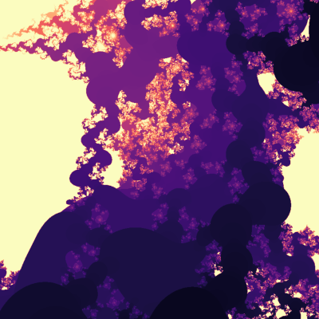

# EML Fractal Explorer
<p align="center">
  
</p>
## Overview

This project explores a novel Mandelbrot-like fractal defined using the operator eml(x,y) described by Andrzej Odrzywołek in: https://arxiv.org/html/2603.21852v2

(3D Mandel-bulb like EML-bulb fractal rendering is under development and not working properly yet)

[
elm(a, b) = e^a - \ln(b)
]

Instead of the classical quadratic iteration, we define a complex dynamical system based on:

[
z_{n+1} = e^{z_n} - \Log(c), \quad z_0 = 0
]

where:

* (c \in \mathbb{C}) is the parameter (pixel coordinate),
* (\Log) is the principal branch of the complex logarithm.

The goal is to study and visualize the set of complex numbers (c) for which the orbit of (z_0 = 0) remains bounded.

---

## Goals

1. Build an interactive visualization tool for the EML Fractal set.
2. Explore the structure and properties of this fractal.
3. Experiment with alternative parameterizations and iteration rules.
4. Optimize rendering performance for real-time exploration.
5. Investigate mathematical properties (stability regions, periodic orbits, etc.).

---

## Core Definition

Primary iteration:

```
z_0 = 0
z_{n+1} = exp(z_n) - Log(c)
```

Escape condition:

```
|z_n| > R  → orbit escapes
```

Typical parameters:

* `R = 20`
* `max_iter = 50–200`

---

## Alternative Formulation (Recommended)

To avoid branch issues with `Log(c)`, use:

```
z_{n+1} = exp(z_n) + λ
```

where:

```
λ = -Log(c)
```

This is numerically more stable and easier to explore.

---

## Current Features

* Static rendering of EML Fractal set
* Interactive navigation:

  * Mouse scroll → zoom
  * Left-click + drag → pan
* Escape-time coloring

---

## Next Development Tasks (Claude Code)

### 1. Performance Optimization

* Replace nested Python loops with NumPy vectorization
* Explore Numba / Cython acceleration
* Optional GPU (CuPy / PyTorch)

### 2. Rendering Improvements

* Smooth coloring refinements
* Histogram coloring
* Continuous potential coloring
* Anti-aliasing

### 3. UI Enhancements

* Add zoom rectangle (right-click drag)
* Reset view button
* Iteration depth slider
* Real-time parameter controls

### 4. Alternative Dynamics

Implement and compare:

* `z_{n+1} = exp(z_n) + λ`
* `z_{n+1} = elm(z_n, c)`
* Hybrid systems:

  ```
  z_{n+1} = exp(z_n) - α·Log(c)
  ```
* Multi-branch logarithm exploration

### 5. Julia Sets

For fixed parameter:

```
f_c(z) = exp(z) - Log(c)
```

Render corresponding Julia sets.

### 6. Numerical Stability

* Handle overflow in `exp(z)`
* Clamp / rescale large values
* Explore log-domain computations

### 7. Mathematical Exploration

* Detect periodic cycles
* Identify stability regions
* Compare with classical Mandelbrot
* Study effect of complex logarithm branches

---

## Architecture Suggestions

### Core Modules

* `compute.py`

  * iteration functions
  * escape-time computation

* `render.py`

  * image generation
  * coloring algorithms

* `viewer.py`

  * interactive UI (matplotlib / PyQt / web)

* `experiments/`

  * alternative formulas
  * research prototypes

---

## Key Challenges

1. **Extreme growth of exp(z)**

   * causes fast divergence
   * requires careful escape thresholds

2. **Branch cut of Log(c)**

   * discontinuity along negative real axis
   * affects visual structure

3. **Non-polynomial dynamics**

   * very different from classical Mandelbrot
   * less predictable structure

---

## Research Directions

* Is there a meaningful “connectedness locus”?
* Does EML Fractal exhibit self-similarity?
* Can we classify stable regions analytically?
* What is the role of logarithm branch choice?
* Is there a canonical normalization for EML dynamics?

# EML-Bulb 3D Explorer

## Project Overview

This project extends the `eml-fractal-explorer` idea into 3D by defining and rendering a new Mandelbulb-like volumetric fractal based on the operator:

```text
eml(x, y) = exp(x) - ln(y)
```

We also use the shorthand:

```text
x ⋄ y := exp(x) - ln(y)
```

The goal is to define a 3D fractal inspired by Mandelbulb, but replacing the classical radial power transform `r^p` with an EML-based radial transform:

```text
ρ = r ⋄ (1 + r) = exp(r) - ln(1 + r)
```

We want to build a voxel-based renderer and extract an isosurface using marching cubes.

---

## Core Mathematical Definition

We work in 3D Cartesian space with points:

```text
v = (x, y, z) ∈ R^3
c = (cx, cy, cz) ∈ R^3
```

For each iteration, convert `v` to spherical coordinates:

```text
r = sqrt(x^2 + y^2 + z^2)

if r > 0:
    theta = arccos(z / r)
    phi = atan2(y, x)
else:
    theta = 0
    phi = 0
```

Define the EML radial transform:

```text
rho = r ⋄ (1 + r) = exp(r) - ln(1 + r)
```

Then apply Mandelbulb-like angular multiplication with parameter `p`:

```text
theta' = p * theta
phi'   = p * phi
```

Convert back to Cartesian:

```text
x' = rho * sin(theta') * cos(phi')
y' = rho * sin(theta') * sin(phi')
z' = rho * cos(theta')
```

Then add the parameter vector:

```text
v_{n+1} = (x', y', z') + c
```

Initial state:

```text
v_0 = (0, 0, 0)
```

The EML-bulb set is the set of parameters `c` for which the orbit of `v_0` remains bounded.

---

## Practical Rendering Interpretation

For volumetric rendering, we do not need a mathematically perfect set-membership proof. Instead, we compute a scalar field over a 3D voxel grid.

For each voxel center `c = (cx, cy, cz)`:

1. Start with `v = (0,0,0)`
2. Iterate the EML-bulb map up to `max_iter`
3. Track either:

   * escape iteration count
   * final radius
   * minimum radius encountered
   * smooth escape score
4. Store a scalar density/value in the voxel grid

Then:

* use **marching cubes** to extract an isosurface
* render/export the mesh

---

## Recommended Scalar Field

Use a scalar field where larger values indicate more “inside-like” behavior.

### Option A: Escape-time density

If orbit escapes at iteration `n`, store:

```text
value = n / max_iter
```

If it does not escape:

```text
value = 1.0
```

This is simple and robust.

### Option B: Soft boundedness score

For example:

```text
value = 1 / (1 + max_radius)
```

or

```text
value = exp(-k * max_radius)
```

This can produce smoother surfaces.

### Option C: Hybrid score

Recommended for first experiments:

```text
if escaped:
    value = n / max_iter
else:
    value = 1.0
```

Then choose an isosurface threshold like:

```text
iso_level = 0.95
```

---

## Initial Parameters

Suggested defaults:

```text
power p          = 8
max_iter         = 24 to 64
escape_radius    = 8.0 or 16.0
grid resolution  = 96^3 initially
bounding box     = [-2, 2]^3
iso_level        = 0.95
```

Possible refinement later:

```text
resolution = 128^3 or 192^3
```

---

## Technical Plan

### Phase 1: Core Scalar Field Generator

Implement a function:

```python
compute_eml_bulb_field(
    xmin, xmax,
    ymin, ymax,
    zmin, zmax,
    nx, ny, nz,
    power=8,
    max_iter=32,
    escape_radius=8.0
) -> np.ndarray
```

Output:

* 3D NumPy array of scalar values
* shape `(nx, ny, nz)`

### Phase 2: Marching Cubes Extraction

Use:

* `skimage.measure.marching_cubes`
  or
* `pyvista`
  or
* `mcubes`

Recommended first choice:

```python
from skimage.measure import marching_cubes
```

Extract:

* vertices
* faces
* normals
* values

### Phase 3: Mesh Export

Support export formats:

* `.obj`
* `.ply`
* optionally `.stl`

### Phase 4: Visualization

Options:

* `pyvista`
* `plotly`
* `trimesh`
* Blender export pipeline

Recommended first:

* preview with `pyvista`
* export OBJ for Blender

---

## Suggested Project Structure

```text
eml-bulb/
├── README.md
├── requirements.txt
├── src/
│   ├── eml_bulb.py          # fractal iteration logic
│   ├── field.py             # voxel field computation
│   ├── marching.py          # marching cubes wrapper
│   ├── export.py            # mesh export helpers
│   ├── preview.py           # quick 3D preview
│   └── utils.py
├── scripts/
│   ├── generate_field.py
│   ├── extract_mesh.py
│   └── preview_mesh.py
├── outputs/
│   ├── fields/
│   └── meshes/
└── experiments/
    ├── slices/
    ├── alternative_radial_forms/
    └── parameter_sweeps/
```

---

## Core Functions To Build

### 1. EML radial function

```python
def eml_radial(r: float) -> float:
    return math.exp(r) - math.log(1.0 + r)
```

### 2. One iteration step

```python
def eml_bulb_step(vx, vy, vz, cx, cy, cz, power):
    ...
    return nx, ny, nz
```

### 3. Orbit evaluation

```python
def eval_point(cx, cy, cz, power, max_iter, escape_radius):
    """
    Return scalar value for voxel field.
    """
```

### 4. Full 3D field generation

Vectorized where possible, but correctness first.

### 5. Marching cubes extraction

```python
def extract_mesh(field: np.ndarray, iso_level: float, bounds: tuple):
    ...
```

---

## Important Numerical Notes

### 1. Growth is extremely fast

Because `exp(r)` grows very aggressively, this fractal will likely escape much faster than a classical Mandelbulb.

Practical consequences:

* use moderate escape radius
* clamp values if necessary
* short max iteration counts may already be enough

### 2. Stability near the origin

Using:

```text
rho = exp(r) - ln(1 + r)
```

avoids singularity at `r = 0`, unlike `ln(r)`.

### 3. Overflow handling

Need defensive programming:

* catch overflow in `exp(r)`
* treat overflow as immediate escape
* avoid NaN propagation

---

## Recommended MVP

Build the following first:

1. Generate a scalar field on a `64^3` or `96^3` grid
2. Use escape-time normalized density
3. Extract an isosurface with marching cubes
4. Export OBJ
5. Preview in PyVista

This is enough to validate whether the geometry is visually interesting.

---

## Potential Improvements

### Adaptive sampling

Use coarse-to-fine refinement near the isosurface.

### Distance estimator

Later, derive a distance-estimation-like field for cleaner surfaces.

### Variants of radial EML

Experiment with:

```text
rho = r ⋄ (1 + r)
rho = r ⋄ (a + b r)
rho = exp(ar) - ln(1 + br)
rho = (r ⋄ (1+r))^q
```

### Alternative angular dynamics

Test:

* different powers `p`
* asymmetric angular scaling
* additive angular perturbations

### Slice explorer

Before full 3D mesh extraction, create 2D slice tools for debugging.

---

## Alternative Definitions To Keep In Mind

The initial EML-bulb definition is:

```text
rho = r ⋄ (1 + r)
theta' = p * theta
phi' = p * phi
v_{n+1} = spherical_to_cartesian(rho, theta', phi') + c
```

But the code should be structured so alternate formulas are easy to swap in.

Design for pluggability:

* separate radial rule
* separate angular rule
* separate density metric

---

## Success Criteria

The project is successful if it can:

1. generate a voxel field for the EML-bulb
2. extract a mesh with marching cubes
3. export/view that mesh
4. make parameter experimentation easy
5. reveal visually interesting 3D structures

---

## Claude Code Guidance

Please implement in small, testable steps.

Priorities:

1. correctness
2. numerical robustness
3. modularity
4. performance

Start with a working scalar-field prototype before optimizing.

When in doubt:

* keep formulas explicit
* avoid premature abstraction
* prefer readable numerical code over clever code

---

## Short Summary

We want to build a 3D fractal explorer for a new Mandelbulb-like object defined by:

```text
rho = r ⋄ (1 + r) = exp(r) - ln(1 + r)
```

combined with spherical angle multiplication and parameter addition.

The rendering pipeline is:

```text
EML-bulb iteration
→ voxel scalar field
→ marching cubes
→ 3D mesh preview/export
```

This is an experimental math-art / fractal-research project, and the first target is a solid MVP with voxel generation and mesh extraction.
